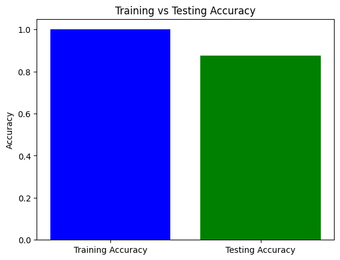

# Image Vegetable Classification Using Back Propagation Neural Network

##Step to classify image

1. Load Data
2. Feature Extraction using HOG
3. Scaling Using Standard Scaler
4. Normalize X input from HOG
5. Creating Model using tensorflow
6. Combine model with Random Search it can explore parameters

##The dataset used for each label is 1025 data

1. Bitter Gourd
2. Broccoli
3. Cabbage
4. Carrot
5. Cucumber
6. Radish

Dataset vegetable [URL](https://www.kaggle.com/datasets/misrakahmed/vegetable-image-dataset).

##Result Analysis

##Classification Report

| Vegetable    | Precicion | Recall | F1-Score |
| ------------ | --------- | ------ | -------- |
| Bitter Gourd | 0.84      | 0.90   | 0.87     |
| Broccoli     | 0.86      | 0.80   | 0.83     |
| Cabbage      | 0.87      | 0.87   | 0.87     |
| Carrot       | 0.93      | 0.83   | 0.87     |
| Cucumber     | 0.91      | 0.91   | 0.91     |
| Radish       | 0.87      | 0.96   | 0.91     |
|              |           |        |          |
| Accuracy     |           |        | 0.88     |
| Macro Avg    | 0.88      | 0.88   | 0.88     |
| Weighted Avg | 0.88      | 0.88   | 0.88     |
